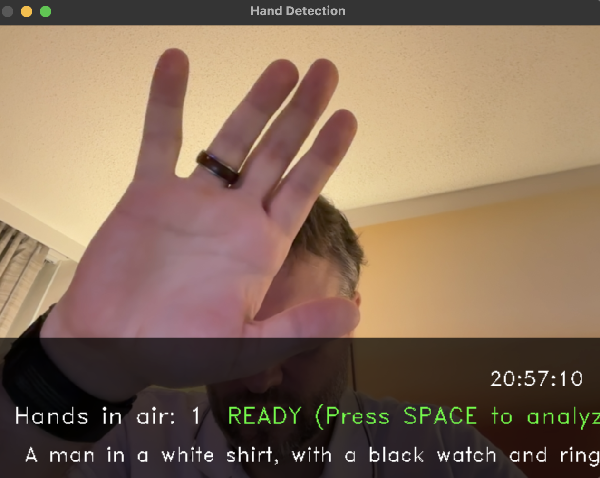

# 🖐 DreamHands




A real-time AI-powered hand detection system that counts raised hands in a video feed. Built with Moondream and OpenCV, it provides instant visual feedback and scene descriptions.

## 🚀 Features

- Real-time webcam hand detection
- Beautiful overlay UI with status indicators
- Space-bar triggered AI analysis
- Scene description capabilities
- Metal Performance Shaders (MPS) support for Apple Silicon
- Fallback to CPU processing when needed

## 🛠 Requirements

- Python 3.x
- Webcam
- Required packages (see requirements.txt)
- Moondream model file

## 📦 Installation

1. Clone the repository:

```
git clone https://github.com/RamboRogers/DreamHands.git 
```

2. Install the required packages:

```
pip install -r requirements.txt
```
3. Run the application:

```
python app.py
```

## A simple hands in the air counter powered by AI

### 2. Controls:
- Press SPACE to analyze the current frame
- Press Q to quit

## 🎯 How It Works

DreamHands uses the Moondream vision-language model to:
1. Capture frames from your webcam
2. Process frames on demand (when spacebar is pressed)
3. Count raised hands in the scene
4. Provide natural language description of the scene
5. Display results in a clean, intuitive overlay

## ⚡ Performance

- Optimized for Apple Silicon with MPS support
- Automatic fallback to CPU processing
- Efficient frame processing
- Responsive UI with real-time feedback

## ⚖️ License

<p>
DreamHands is licensed under the GNU General Public License v3.0 (GPLv3).<br>
<em>Free Software</em>
</p>

[](https://www.gnu.org/licenses/gpl-3.0)

### Connect With Me 🤝

[](https://github.com/RamboRogers)
[](https://x.com/rogerscissp)
[](https://matthewrogers.org)

## 🙏 Acknowledgments

- Built with [Moondream](https://github.com/vikhyat/moondream)
- OpenCV for video processing
- PyTorch for AI acceleration

### 